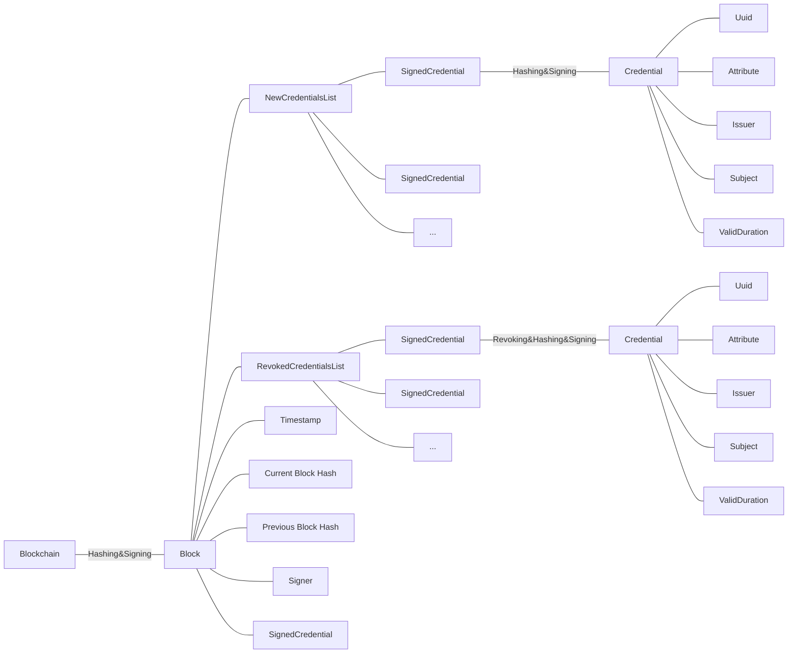
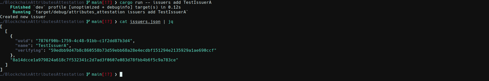
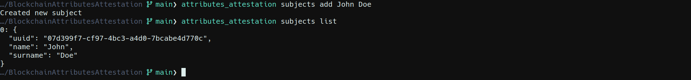
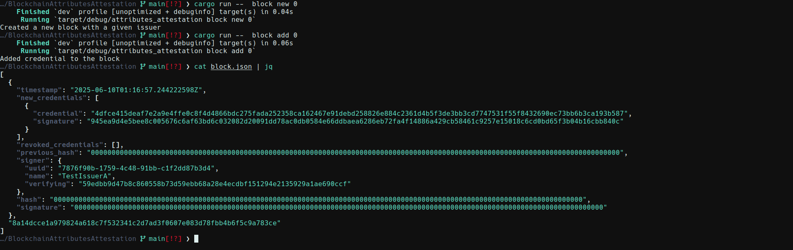
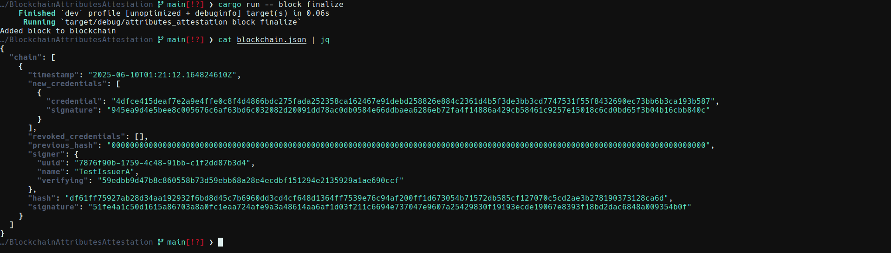
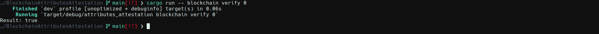

# Blockchain Attributes Attestation
# Introduction
This project demostrate blockchain-based attestation system for managing attributes.

# Description
## Project assumptions

- **Entity**: Issuing Authority (e.g., local government) – issues the credential.
- **User**: Citizen – stores the credential.
- **Verifier**: Third party – verifies the authenticity of the credential.
- **Blockchain**: Credentials ledger - Used for registering hashes/digests of credentials (not personal data).

## Key Actors
| Role    | Description |
| :--------: | :-------: |
| Issuer (QTSP) | A trusted authority (e.g., government agency) that issues attribute credentials to users. |
| Holder | The end user (citizen or company) who holds the Verifiable Credential |
| Verifier | A relying party (e.g., service provider) that needs to verify a user's attribute|
| Blockchain Network | A distributed ledger used to anchor cryptographic proofs (e.g., hashes of credentials), not to store personal data. |

## Structure graph


# Runnging project
## Building project
```
cargo build --all-features
```

## Testing project
```
cargo test
// OR
cargo tarpaulin --skip-clean
```

## Runing program
```
attributes_attestation --help
```

### Blockchain initialization
```
attributes_attestation blockchain init
```
||
|:--:| 
| *Blockchain initialization* |

### Issuer creation 
```
attributes_attestation issuers add <issuer_name>
```

||
|:--:| 
| *Issuer creation* |


### Subject creation
```
attributes_attestation subjects add <name> <surname>
```

||
|:--:| 
| *Subject creation* |

### Credential creation
```
attributes_attestation credentials add <issuer_index> <subject_index> <credential_name> <credential_value> <from> <to>
```

||
|:--:| 
| *Credential creation* |


### Block creation
```
attributes_attestation block new <issuer_index>
attributes_attestation block add <credential_index>
```

||
|:--:| 
| *Block creation* |


### Adding  block to blockchain (finalize)
```
attributes_attestation block finalize
```

||
|:--:| 
| *Adding  block to blockchain* |

### Credential verification
```
attributes_attestation blockchain verify <credential_index>
```

||
|:--:| 
| *Credential verification* |


### Credential revokation
```
attributes_attestation blockchain revoke <credential_index>
```

### List contents of Issuer, Subject, Credential, Block, Blockchain
```
attributes_attestation issuers list
attributes_attestation subjects list
attributes_attestation credentials list
attributes_attestation block display
attributes_attestation blockchain display
```

