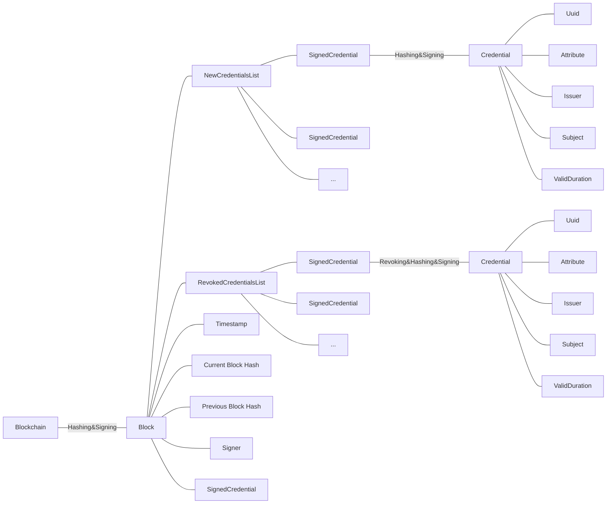

# Blockchain Attributes Attestation

# Introduction

# Runnging project
## Building project
```
cargo build
```

## Runing program
```
cargo run
```

# Description
## Project assumptions

- **Entity**: Issuing Authority (e.g., local government) – issues the credential.
- **User**: Citizen – stores the credential.
- **Verifier**: Third party – verifies the authenticity of the credential.
- **Blockchain**: Credentials ledger - Used for registering hashes/digests of credentials (not personal data).


## Key Actors
| Role    | Description |
| :--------: | :-------: |
| Issuer (QTSP) | A trusted authority (e.g., government agency) that issues attribute credentials to users. |
| Holder | The end user (citizen or company) who holds the Verifiable Credential |
| Verifier | A relying party (e.g., service provider) that needs to verify a user's attribute|
| Blockchain Network | A distributed ledger used to anchor cryptographic proofs (e.g., hashes of credentials), not to store personal data. |

## Structure graph
### Full Graph

